# **HAND TACTICS 仕様書**

## **目次**

*   
  **1\.概要**
  * 1.1. ゲームのコンセプト  
  * 1.2. ターゲット層  
  * 1.3. プラットフォーム
*   
  **2\. ゲームシステム**  
  * 2.1. 勝利条件・基本ルール  
  * 2.2. ゲームフロー  
  * 2.3. コアメカニクス（じゃんけんバトル） 
    * 2.3.1 ターン開始時の「手」の選択
    * 2.3.2 バトル時の属性相性
  * 2.4. デッキ構築  
  * 2.5. オンライン機能  
  * 2.6. CPU対戦
*   
  **3\. 画面仕様詳細・オブジェクト構造**  
  * 3.1. 画面遷移図  
  * 3.2. 各画面の詳細レイアウト  
    * 3.2.1 タイトル (Scene: Start)
    * 3.2.2 ホーム (Scene: Home)
    * 3.2.3 デッキ一覧(Scene: DeckList)
    * 3.2.4 デッキ構築 (Scene: Deck)
    * 3.2.5 対戦デッキ選択 (Scene: DeckSelect)
    * 3.2.6 マッチ選択 (Scene: Matching)
    * 3.2.7 バトル (Scene: Battle)
*   
  **4\. アセット・データリスト**  
  * 4.1. カード構造 (Prefab)  
  * 4.2. カードリスト  
  * 4.3. グラフィック・UI素材  
  * 4.4. サウンド

## **1. 概要**

### **1.1. ゲームのコンセプト**

「運」と「読み合い」が融合した、1v1じゃんけんカードバトル  
デジタルカードゲームの戦略性に、誰もが知る「じゃんけん」の要素をミックス。  
単なる属性相性だけでなく、「毎ターンのじゃんけん勝負」の結果がカードの強さを変化させる独自のシステムにより、高度な読み合いと劇的な逆転要素を提供する。

### **1.2. ターゲット層**

* ムシキングや恐竜キングをプレイしていた世代（20代）。  
* 「読み合い」と「運要素」の揺らぎを求めているプレイヤー。

### **1.3. プラットフォーム**

* **PC / Unityroom**  
  * 画面比率維持スクリプト (AspectRatioEnforcer.cs) により、ウィンドウサイズ変更時も16:9のアスペクト比を保持。

## **2. ゲームシステム**

### **2.1. 勝利条件・基本ルール**

* **プレイヤー数** 2人
* **勝利条件:** 相手リーダーのライフを **0** にする  
* **敗北条件:** 自分リーダーのライフが **0** になる
* **初期ライフ:** 20
* **手札上限** 6枚(6枚を超えて引かない)  
* **デッキ上限** 32枚
* **フィールド上限** 6枚ずつ
* **リソース:** マナ（PP）。毎ターン最大値が1増え、全回復する（最大10）
* **カードプレイ** マナを消費して、スペルやモンスターをプレイし、相手のモンスターやリーダーを攻撃して勝利を目指す

### **2.2. ゲームフロー**

1. **タイトル**  
2. **ホーム**  
3. **準備フェイズ**  
   * デッキ構築（所持カードから32枚を選択）、デフォルトデッキあり  
   * CPU対戦　or オンライン対戦（Photonで対戦相手を検索）  
4. **バトルフェイズ**  (繰り返し)
   * **マリガン:** 手札3枚を確認し、不要なカードを交換  
   * **ターン進行:** ドロー → じゃんけん → アクション → ターン終了  
5. **リザルト**  
   * 勝敗表示後、再戦またはホームへ

### **2.3. コアメカニクス（じゃんけんバトル）**

このゲーム最大の特徴である「じゃんけんシステム」は、以下の2層構造で成り立っている。

#### **2.3.1. ターン開始時の「手」の選択**

毎ターン開始時、プレイヤーは グー チョキ パー のいずれかを選択する。この結果は、そのターン中の全てのカード効果に影響を与える。

* **Win Bonus (勝利時):** じゃんけんに勝っていると、カードが強化される（コストダウン、パワーアップ、ドローなど）。  
* **Lose Bonus (敗北時):** 負けている時のみ発動する強力なカウンター効果（スピードアタッカー化、トークン召喚など）。  
* **Hand Synchro (属性一致):** 自分が選んだ「手」と同じ属性のカードはボーナスを得る(基本はコストマイナス１)。

#### **2.3.2. バトル時の属性相性**

ユニット同士の戦闘でもじゃんけん属性（✊✌️✋）が勝敗を分ける。

* **有利 (例: ✊ vs ✌️):** 相手を一方的に破壊する。  
* **不利 (例: ✊ vs ✋):** 自分が一方的に破壊される。  
* **あいこ:** Power（攻撃力）が高い方が勝つ。同じなら相打ち。

### **2.4. デッキ構築ルール**

* **デッキ枚数:** **32枚** 固定。
* **同盟カードは三枚まで**。
* **カードプール:** 全51種類（トークン含む）。  
* **構築画面:**  
  * 所持カード（Stock）とデッキ（Deck）の2画面構成。  
  * ドラッグ＆ドロップでカードを入れ替える直感的な操作。  
  * デッキは2ページ（16枚×2）で表示される。

### **2.5. オンライン機能 PUN2(Photon Unity Networking 2)**

* **ランダムマッチング:** 世界中のプレイヤーと即座に対戦。  
* **リアルタイム同期:**(RPC同期)  
  * カードのプレイ、移動、攻撃、効果  
  * じゃんけんの選択  
  * ライフ、マナの変動  
  * エモートや切断状態の同期
  
### **2.6. CPU対戦**

* プレイヤーと同じデッキをCPUが使用し、対戦する。
* [CPU仕様書](CPU_Specifications.md)

## **3. 画面仕様詳細・オブジェクト構造**

### **3.1. シーン一覧**
  * タイトル **(Start)**
  * ホーム **(Home)**
  * デッキ一覧 **(DeckList)**
  * デッキ構築 **(Deck)**
  * 対戦デッキ選択 **(DeckSelect)**
  * マッチ選択 **(Matching)**
  * バトル **(Battle)**

### **3.1. 画面遷移図**
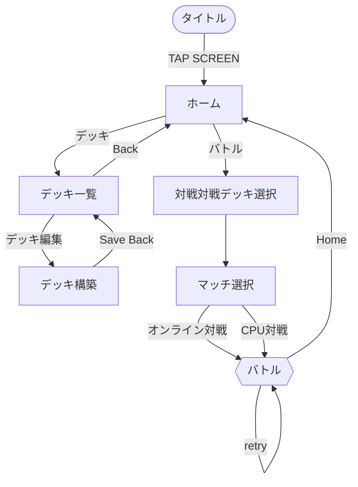
### **3.2. 各画面の詳細レイアウト**

#### **3.2.1. タイトル (Scene: Start)**

* **背景:** 赤・緑・青の3色パネルを背景に、中央に「HAND TACTICS」のロゴ。  
* **演出:** ✊✌️✋の手のイラストがロゴと共に回転。  
* **UI** 
  * 画面下部に大小する「TAP SCREEN」の文字(パルスアニメーション)。
  * 画面をクリックするとホーム(Home)へシーン遷移、画面全体をボタンにする。  
* **詳細なオブジェクト構造・パラメータ:** [SceneStructure_Start_Detailed.txt](Structure_text/SceneStructure_Start_Detailed.txt)を参照。
  
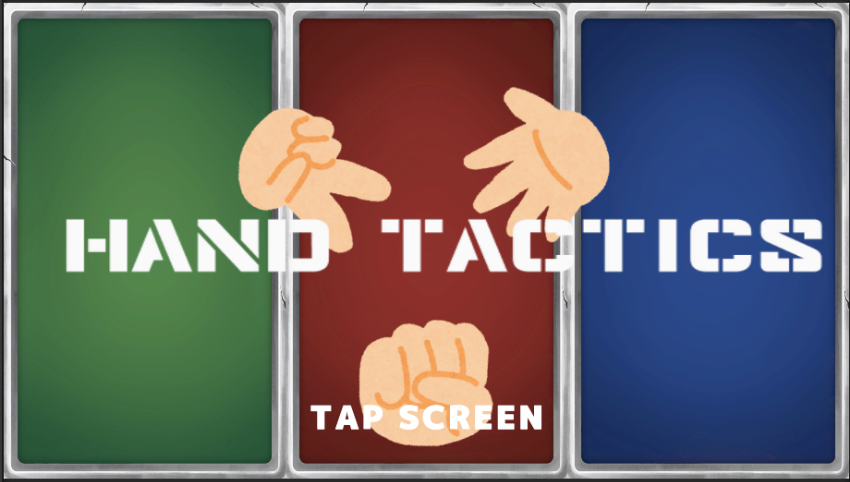

#### **3.2.2. ホーム (Scene: Home)**

* **背景:** ダークブルーの背景 (bg_menu) に、カードが上から降り注ぐ演出 (MenuCardSpawner)。  
* **UI構成:** 画面下部に大きなボタンを配置。  
  * **[バトル] ボタン** : クリックでDeckSelectへシーン遷移。
  * **[デッキ編集] ボタン** : クリックでDeckListへシーン遷移。
* **詳細なオブジェクト構造・パラメータ:**  [SceneStructure_Home_Detailed.txt](Structure_text/SceneStructure_Home_Detailed.txt) を参照。
  

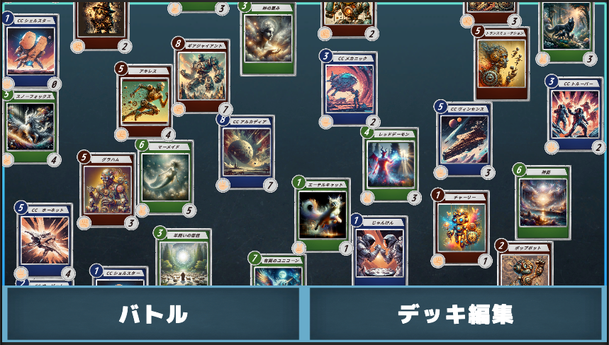

#### **3.2.3. デッキ一覧(Scene: DeckList)**

* **レイアウト:** 中央に縦並びのボタンリスト。  
  * **[Defaultを編集] ボタン** : Defaultの情報をもってDeckへシーン遷移。
  * **[Deck1を編集]  ボタン** : Deck1の情報をもってDeckへシーン遷移。
  * **[Deck2を編集]  ボタン** : Deck2の情報をもってDeckへシーン遷移。
* **ヘッダー:** 左上に **[Back]ボタン** : Homeへシーン遷移    
* **詳細なオブジェクト構造・パラメータ:**  [SceneStructure_DeckList_Detailed.txt](Structure_text/SceneStructure_DeckList_Detailed.txt), 
  
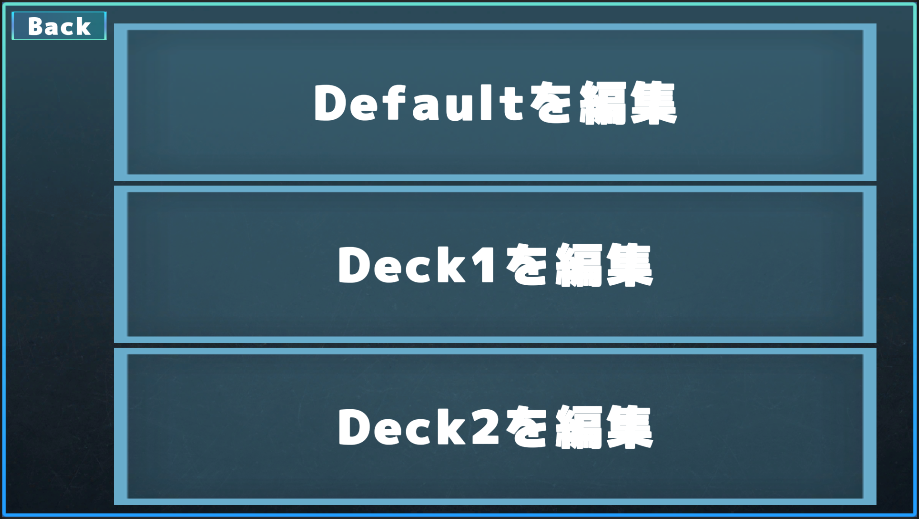

#### **3.2.4. デッキ構築 (Scene: Deck)**

* **レイアウト:**  
  * **上段 (Deck):** 編集中のデッキ内容。2列×8枚＝16枚が表示される（**[左右の矢印] ボタン**でページ切り替え）。  
  * **下段 (Stock):** 所持カード一覧。1列×6枚が表示される（**[左右矢印]ボタン**でスクロール）。  
  * **ヘッダー:** 
    * **[Reset] ボタン** : デッキをクリア。
    * **[Save/Back] ボタン** :　保存してDeckListにシーン遷移。  
* **操作:** 下段から上段へ（またはその逆へ）カードをドラッグ＆ドロップして入れ替え。  
* **詳細なオブジェクト構造・パラメータ:**  [SceneStructure_Deck_Detailed.txt](Structure_text/SceneStructure_Deck_Detailed.txt) を参照。

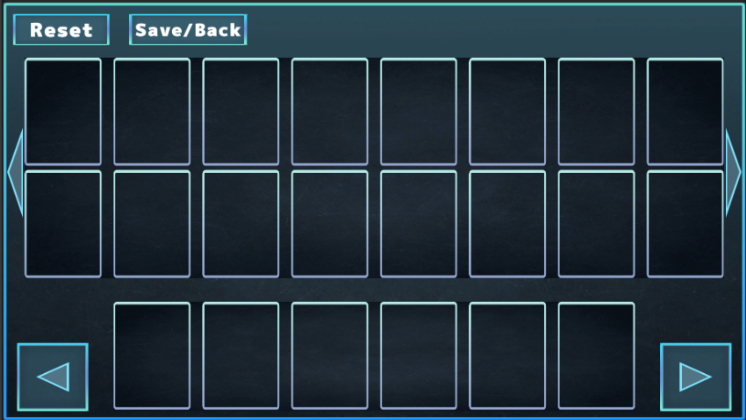
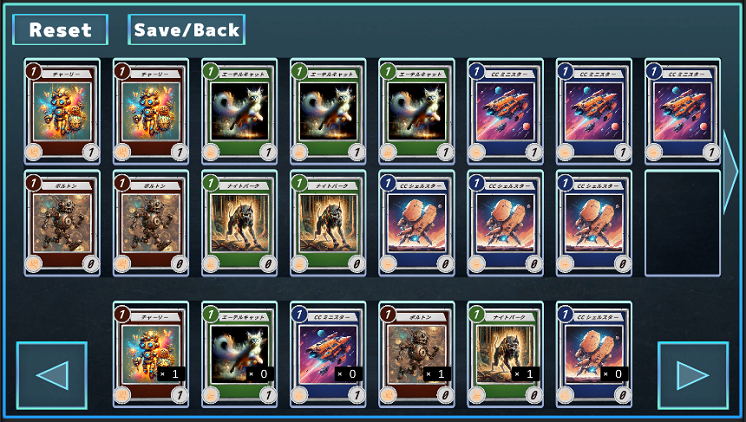

#### **3.2.5. 対戦デッキ選択 (Scene: DeckSelect)**

* **レイアウト:** 中央に縦並びのボタンリスト。  
  * **[Defaultでバトル] ボタン** : Defaultの情報をもってBattleへシーン遷移。
  * **[Deck1でバトル] ボタン** : Deck1の情報をもってBattleへシーン遷移。
  * **[Deck2でバトル] ボタン** : Deck2の情報をもってBattleへシーン遷移。
* **ヘッダー:** 左上に **[Back]** ボタン : Homeへシーン遷移。  
* **エラー表示:** デッキ枚数が32枚でない場合、ボタン上に警告メッセージを表示。  
* **詳細なオブジェクト構造・パラメータ:** [SceneStructure_DeckSelect_Detailed.txt](Structure_text/SceneStructure_DeckSelect_Detailed.txt) を参照。

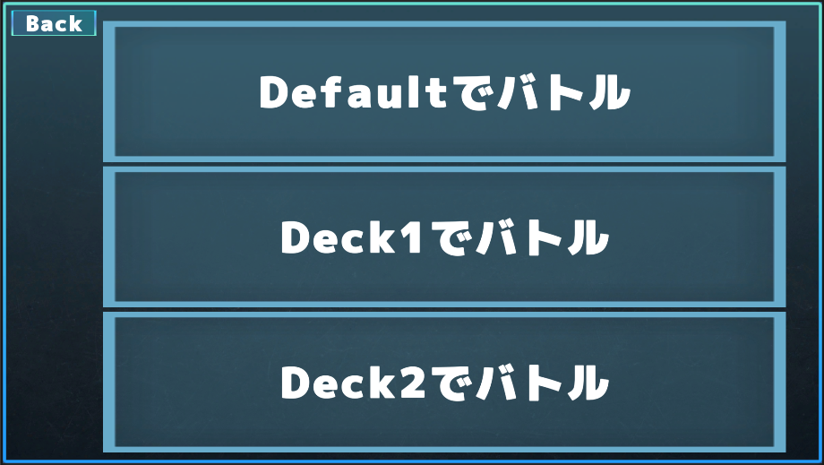
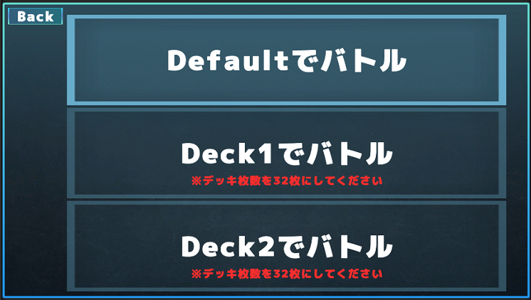

#### **3.2.6. マッチ選択 (Scene: Matching)**

* **レイアウト:** 
  *  **[オンライン対戦する] ボタン** : サーバーに接続し、マッチング開始、マッチング中の表記に変更。マッチングしたら、Battleシーンへ遷移。 
  * **[CPU対戦する] ボタン** : サーバーに接続せず、そのままBattleシーンへ遷移。
* **ヘッダー:** 左上に **[Back]ボタン** : Homeへシーン遷移。
* **詳細なオブジェクト構造・パラメータ:** [SceneStructure_Matching_Detailed.txt](Structure_text/SceneStructure_Matching_Detailed.txt) を参照。

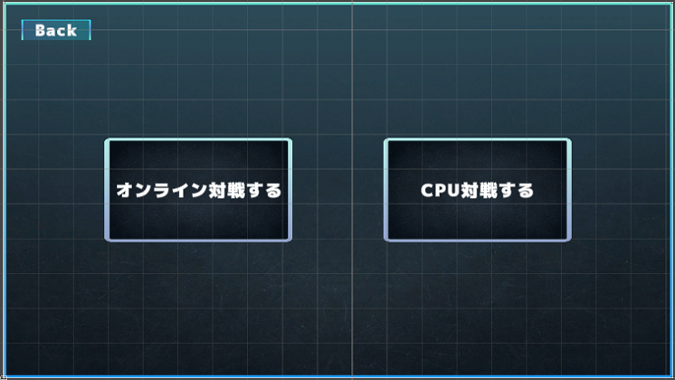
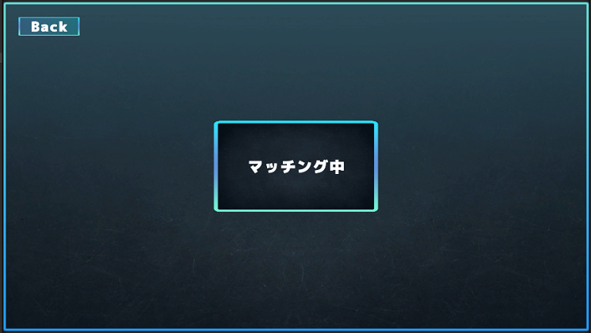

#### **3.2.7. バトル (Scene: Battle)**

* **全体レイアウト:**  
  * **フィールド:** 画面中央。カードを配置するプレイエリア。
    *  PlayerField : プレイヤーがカードを出すエリア。
    *  EnemyField : 敵プレイヤーがカードを出すエリア。
  * **リーダー:**  
    * **Player:** 左下 (blue_box枠)。HPはハートアイコン上にテキストで表示。  
    * **Enemy:** 右上 (red_box枠)。対角線上に配置される。  
  * **サイドバー (右側):**  
    * **じゃんけんカウント:** 上部。相手手札内の✊✌️✋の枚数を表示。  
    * **TurnEndボタン:** 中央。青い円形ボタン。
    * * **マナ表示:** TurnEndボタンを挟んで配置。赤（敵）と青（自分）のダイヤ型アイコンで数値 (10/10など) を表示。  
  * **サイドバー (左側):**  
    * **設定（歯車）ボタン** : 押すと退出するかどうか聞く **GearPanel**が出る。
      * **GearPanel** に **[Home]ボタン**と **[close]ボタン**を作る
    * **サウンド（スピーカー）ボタン** : 音量調節のUIが出る。 
  * **手札:** 画面下部中央。  
* **演出:** 
  * ターン開始時、画面中央にターンの変更を知らせるカットインパネルが表示される。 
  * 画面中央にJankenProcessで使用する **JankenPanel**を作る。
* **詳細なオブジェクト構造・パラメータ:**  [SceneStructure_Battle_Detailed.txt](Structure_text/SceneStructure_Battle_Detailed.txt)を参照。
  
* **背景UIのみ**

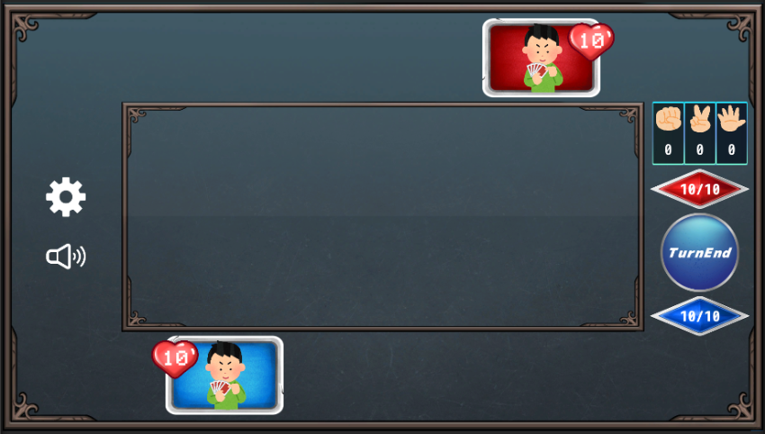

* **マリガン時**

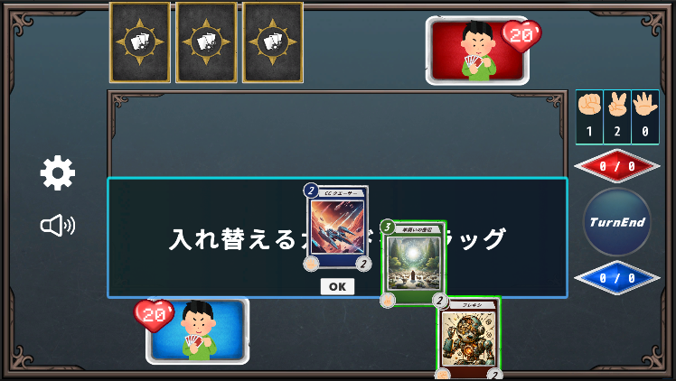

* **自分ターン開始時**

* **相手ターン開始時**

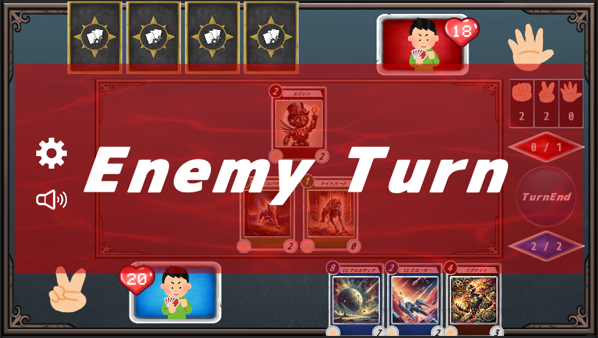

* **じゃんけん時**

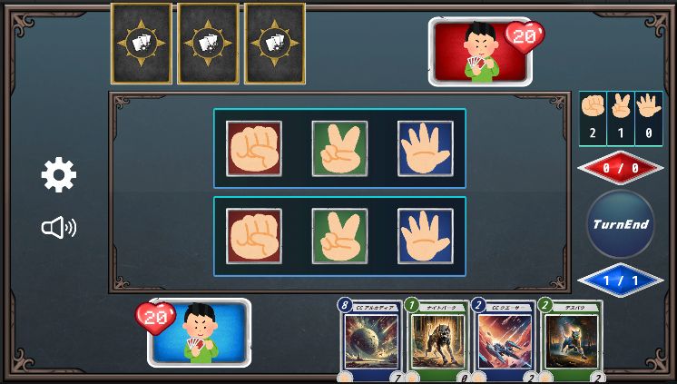

* **ゲームプレイ時**

* **ゲーム勝利時**

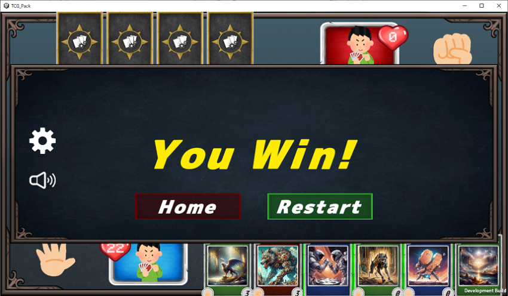

* **ゲーム敗北時**

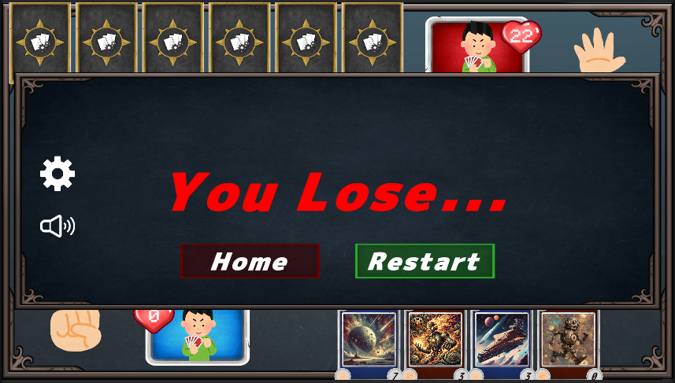

* **対戦相手が抜けた時**

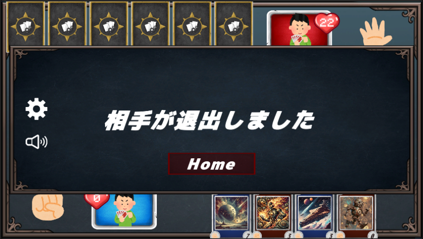

* **歯車ボタンを押したとき**

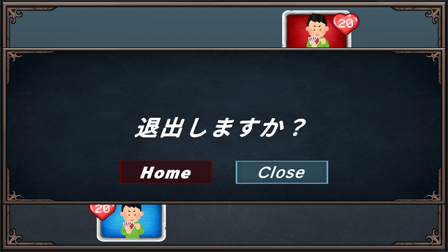

* **スピーカーボタンを押したとき**
  

## **4. アセット・データリスト**

### **4.1. カード構造 (Prefab: Card)**

**カードUIは以下のレイアウトで構成される。**

* **コスト:** 左上（白の丸枠に属性に応じた色に白文字）。  
* **カード名:** 上部帯（白背景）。  
* **イラスト:** 中央（大きく配置）。  
* **パワー:** 右下（白の丸枠に黒字）。  
* **属性:** 左下（✊✌️✋のアイコン）。  
* **テキスト:** なし、CardDetailPanelに記述。
* **枠色:** 属性に応じて赤・緑・青に変化 (CardPanel1/2/3)。  
* **詳細なオブジェクト構造・パラメータ:**  [PrefabStructure_Card.txt](Structure_text/PrefabStructure_Card.txt)を参照。

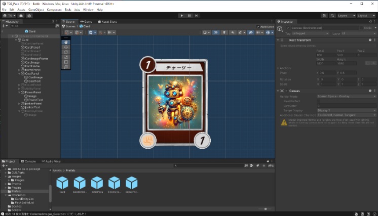

**どのシーンでもカードをクリックするとCardDetailPanelが開かれる、もう一度画面をクリックすると閉じる。**

* **詳細なオブジェクト構造・パラメータ:**  [PrefabStructure_CardDtailPanel.txt](Structure_text/PrefabStructure_CardDetailPanel.txt)を参照。
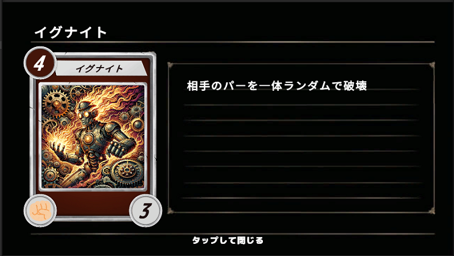

### **4.2. カードリスト**

全51種類のカードデータ（ID: 0〜50）。

* **属性 (Attr):** ✊=グー(1), ✌️=チョキ(2), ✋=パー(3)
* **Stat:**  Cost / Power  
* **詳細パラメータ（効果値など）:**  [AllCardEntities.txt](Structure_text/AllCardEntities.txt)または  [CardEntities_Diff.txt](Structure_text/CardEntities_Diff.txt)を参照。
* **使用画像 :**  [CollectedImages_Selection](CollectedImages_Selection)を参照

| ID | Name | Attr | Type | Stat | Image File | Ability (効果概要) |
| :---- | :---- | :---- | :---- | :---- | :---- | :---- |
| **0** | チャーリー | ✊ | Monster | 1/1 | card0.jpg | (バニラ) |
| **1** | エーテルキャット | ✌️ | Monster | 1/1 | card1.1.jpg | (バニラ) |
| **2** | CC ミニスター | ✋ | Monster | 1/1 | card2.jpg | (バニラ) |
| **3** | ボルトン | ✊ | Monster | 1/0 | card3.jpg | **[条件:勝]** スピードアタッカー (Speed Attacker) |
| **4** | ナイトバーク | ✌️ | Monster | 1/0 | card4.jpg | **[条件:勝]** スピードアタッカー |
| **5** | CC シェルスター | ✋ | Monster | 1/0 | card5.jpg | **[条件:勝]** スピードアタッカー |
| **6** | ポップボット | ✊ | Monster | 2/2 | card6.jpg | **[条件:一致]** Power+1 |
| **7** | グリムファング | ✌️ | Monster | 2/2 | card7.jpg | **[条件:一致]** Power+1 |
| **8** | CC オービット | ✋ | Monster | 2/2 | card8.jpg | **[条件:一致]** Power+1 |
| **9** | エジソン | ✊ | Monster | 2/2 | card9.jpg | **[条件:勝]** 1ドロー |
| **10** | デスパウ | ✌️ | Monster | 2/2 | card10.jpg | **[条件:勝]** スピードアタッカー |
| **11** | CC クエーサー | ✋ | Monster | 2/2 | card11.jpg | **[条件:勝]** Power+2 |
| **12** | フレキシ | ✊ | Monster | 3/2 | card12.1.jpg | 自分2回復 / **[条件:勝]** さらに2回復(計4) |
| **13** | 羊飼いの僧侶 | ✌️ | Monster | 3/2 | card13.jpg | 自分2回復 / **[条件:勝]** さらに2回復(計4) |
| **14** | CC メカニック | ✋ | Monster | 3/2 | card14.jpg | 自分2回復 / **[条件:勝]** さらに2回復(計4) |
| **15** | ダーヴィン | ✊ | Monster | 3/2 | card15.jpg | マナ最大値+1 (Mana Boost) |
| **16** | リトルデーモン | ✌️ | Monster | 3/2 | card16.jpg | 相手に3ダメージ |
| **17** | CC トルーパー | ✋ | Monster | 3/2 | card17.jpg | **[条件:一致]** 1ドロー |
| **18** | イグナイト | ✊ | Monster | 4/3 | card18.jpg | **[破壊]** 相手の「✋パー」を1体破壊 |
| **19** | レッドデーモン | ✌️ | Monster | 4/3 | card19.jpg | **[破壊]** 相手の「✊グー」を1体破壊 |
| **20** | CC フルクラム | ✋ | Monster | 4/3 | card20.jpg | **[破壊]** 相手の「✌️チョキ」を1体破壊 |
| **21** | アンビュール | ✊ | Monster | 4/3 | card21.jpg | **[条件:負]** 「エーテルキャット(✌️)」を召喚 |
| **22** | デュアルサモナー | ✌️ | Monster | 4/3 | card22.jpg | **[条件:負]** 「CC ミニスター(✋)」を召喚 |
| **23** | CC ブルースター | ✋ | Monster | 4/3 | card23.jpg | **[条件:負]** 「チャーリー(✊)」を召喚 |
| **24** | アキレス | ✊ | Monster | 5/4 | card24.jpg | スピードアタッカー (Speed Attacker) |
| **25** | スノーフォックス | ✌️ | Monster | 5/4 | card25.1.jpg | スピードアタッカー |
| **26** | CC　ホーネット | ✋ | Monster | 5/4 | card26.jpg | スピードアタッカー |
| **27** | グラハム | ✊ | Monster | 5/3 | card27.jpg | 手札に「ナイトバーク(✌️速)」「CC シェルスター(✋速)」を加える |
| **28** | フェンリル | ✌️ | Monster | 5/3 | card28.jpg | 手札に「ボルトン(✊速)」「CC シェルスター(✋速)」を加える |
| **29** | CC ヴィンセンス | ✋ | Monster | 5/3 | card29.jpg | 手札に「ボルトン(✊速)」「ナイトバーク(✌️速)」を加える |
| **30** | ギアパンクファング | ✊ | Monster | 6/3 | card30.jpg | **[条件:一致]** Power+2 & スピードアタッカー |
| **31** | グリフォン | ✌️ | Monster | 6/3 | card31.jpg | **[条件:一致]** Power+2 & スピードアタッカー |
| **32** | CC ヤマト | ✋ | Monster | 6/3 | card32.jpg | **[条件:一致]** Power+2 & スピードアタッカー |
| **33** | クシナガラ | ✊ | Monster | 6/5 | card33.jpg | 自分4回復 / **[条件:一致&勝]** さらに2回復 |
| **34** | マーメイド | ✌️ | Monster | 6/5 | card34.jpg | 自分4回復 / **[条件:一致&勝]** さらに2回復 |
| **35** | CC アストロフォートレス | ✋ | Monster | 6/5 | card35.jpg | 自分4回復 / **[条件:一致&勝]** さらに2回復 |
| **36** | 阿修羅 | ✊ | Monster | 7/5 | card36.1.jpg | **[条件:一致&勝]** トークン(✌️速)(✋速)を召喚 |
| **37** | 有翼のユニコーン | ✌️ | Monster | 7/5 | card37.1.jpg | **[条件:一致&勝]** スピードアタッカー / **[条件:負]** Power+2 |
| **38** | CC アポカリプス | ✋ | Monster | 7/5 | card38.1.jpg | **[条件:一致]** 4回復 & 2ドロー |
| **39** | ギアジャイアント | ✊ | Monster | 8/7 | card39.jpg | **[破壊]** 相手の「✊グー」「✋パー」を全て破壊 |
| **40** | ニーズヘッグ | ✌️ | Monster | 8/7 | card40.jpg | **[破壊]** 相手の「✊グー」「✌️チョキ」を全て破壊 |
| **41** | CC アルカディア | ✋ | Monster | 8/7 | card41.1.jpg | **[破壊]** 相手の「✌️チョキ」「✋パー」を全て破壊 |
| **42** | じゃんけん | ✋ | Spell | 1/- | card42.jpg | じゃんけんを行う |
| **43** | ラウンチロケット | ✋ | Spell | 2/- | card43.jpg | 1ドロー |
| **44** | 神の恵み | ✌️ | Spell | 3/- | card44.jpg | マナ最大値+1 |
| **45** | 二本の薬品 | ✌️ | Spell | 4/- | card45.jpg | 自分2回復、相手2ダメージ |
| **46** | トランスミューテション | ✊ | Spell | 5/- | card46.jpg | トークン(✊速)(✌️速)(✋速)を全て召喚 |
| **47** | 神罰 | ✌️ | Spell | 6/- | card47.jpg | **[破壊]** 全てのカードを破壊 |
| **48** | グートークン | ✊ | Monster | 0/1 | janken_gu.png | スピードアタッカー (トークン) |
| **49** | チョキトークン | ✌️ | Monster | 0/1 | janken_choki.png | スピードアタッカー (トークン) |
| **50** | パートークン | ✋ | Monster | 0/1 | janken_pa.png | スピードアタッカー (トークン) |

* ※CCはCosmic Combatの略

### **4.3. グラフィック・UI素材**
* **[CollectedImages_Scene_Start](CollectedImages_Scene_Start)** Startシーンの画像素材フォルダ。
* **[CollectedImages_Scene_Home](CollectedImages_Scene_Home)** Homeシーンの画像素材フォルダ。
* **[CollectedImages_Scene_DeckList](CollectedImages_Scene_DeckList)** DeckListシーンの画像素材フォルダ。
* **[CollectedImages_Deck](CollectedImages_Deck)** Deckシーンの画像素材フォルダ。
* **[CollectedImages_Scene_DeckSelect](CollectedImages_Scene_DeckSelect)** DeckSelectシーンの画像素材フォルダ。
* **[CollectedImages_Scene_Matching](CollectedImages_Scene_Matching)** Matchingシーンの画像素材フォルダ。
* **[CollectedImages_Battle](CollectedImages_Battle)** Battleシーンの画像素材フォルダ。
* **[CollectedImages_Card](CollectedImages_Card)** CardPrefabの画像素材フォルダ。
* **[CollectedImages_CardDetailPanel](CollectedImages_CardDetailPanel)** CardDetailPanelPrefabの画像素材フォルダ。
* **[CollectedImages_EnemyHandCard](CollectedImages_EnemyHandCard)** EnemyHandCardPrefabの画像素材フォルダ。

### **4.4. サウンド**

* **BGM:**  
  * menuBGM: タイトル〜対戦デッキ選択  
  * mix_2m57s...: バトル  
* **SE:**  
  * ターンエンドボタン2, Attack2..., 召喚3, 魔法, 決定ボタンを押す50 など全18種。  
  * **詳細なオブジェクト:**  [SceneStructure_Battle_Detailed.txt](Structure_text/SceneStructure_Battle_Detailed.txt) (SoundManagerの項目)を参照。
  
* **音声ファイル:**
  * [Assets_Sounds](Assets_Sounds)を参照。

